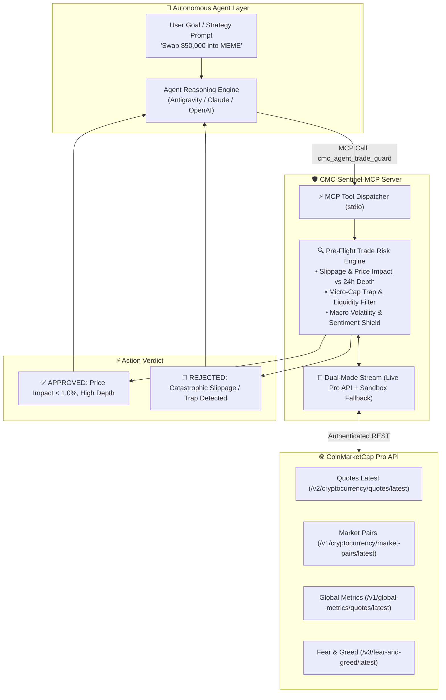

# 🛡️ CMC-Sentinel-MCP: Autonomous Risk Firewall for AI Trading Agents

[](https://opensource.org/licenses/MIT)
[](https://coinmarketcap.com/api/)
[-8B5CF6.svg)](https://modelcontextprotocol.io/)
[](https://www.typescriptlang.org/)
[](https://dorahacks.io/hackathon/coinmarketcap-api-202609/detail)
[](https://x.com/KHuoguo/status/2101521009707024784)

> **Build with CMC: API Hackathon Submission**  
> **Track 2: AI Agents and Automation**  
> **Live Web Terminal & Simulation**: [https://moyu-dev16.github.io/cmc-agent-sentinel/](https://moyu-dev16.github.io/cmc-agent-sentinel/)  
> **Official X / Twitter Announcement**: [https://x.com/KHuoguo/status/2101521009707024784](https://x.com/KHuoguo/status/2101521009707024784)

---

## ⚡ The Problem: The "Blind Agent" Dilemma in Web3

Autonomous AI agents (trading bots, rebalancers, intent-based execution swarms) are rapidly entering decentralized finance. However, LLMs lack real-time ground truth:
1. **Slippage Blindness**: LLMs hallucinate liquidity depth and approve swap orders that cause 10-50% negative price impact on thin DEX pools.
2. **Honeypot & Micro-Cap Traps**: Malicious actors create clone tokens with fake tickers. LLMs execute trades on non-verified pairs with zero sell volume.
3. **Macro Ignorance**: Autonomous bots continue high-frequency aggressive rebalancing during extreme panic cascades (Fear & Greed index < 15) without volatility dampening.

---

## 🚀 The Solution: CMC-Sentinel

**CMC-Sentinel-MCP** is an enterprise-grade Model Context Protocol (MCP) server that transforms CoinMarketCap's Pro API into an **autonomous pre-flight execution firewall** for AI agents.

Before any agent dispatches an on-chain transaction or executes a swap, it consults Sentinel via standardized MCP tool calls. Sentinel interrogates CMC's live liquidity pairs, 24h market depth, price deviations, and macro sentiment to **APPROVE**, **WARN**, or **REJECT** the trade.



---

## 🛠️ MCP Tools Reference

CMC-Sentinel exposes 6 tools designed for LLM consumption:

| MCP Tool Name | CMC Pro Endpoint | Description & Agent Utility |
| :--- | :--- | :--- |
| `cmc_agent_trade_guard` | Multi-endpoint fusion (`/v2/quotes`, `/v1/market-pairs`, `/v3/fear-and-greed`) | **Core Risk Engine**: Calculates expected slippage against 24h volume/depth, checks token liquidity health, tests macro volatility, and returns structured `APPROVED` / `REJECTED` verdicts. |
| `cmc_get_quote` | `/v2/cryptocurrency/quotes/latest` | Fetches real-time price, 24h volume, market cap, and 1h/24h/7d price change for single or multiple tokens. |
| `cmc_market_pairs` | `/v1/cryptocurrency/market-pairs/latest` | Retrieves top DEX/CEX trading pairs, exchange names, fee tiers, and 24h depth indicators to prevent routing through illiquid pools. |
| `cmc_global_metrics` | `/v1/global-metrics/quotes/latest` | Ingests macro market health: total crypto market cap, 24h market volume, BTC dominance %, and active cryptocurrency counts. |
| `cmc_fear_and_greed` | `/v3/fear-and-greed/latest` | Pulls current market sentiment score (0-100) and classification (`Extreme Fear`, `Fear`, `Neutral`, `Greed`, `Extreme Greed`). |
| `cmc_status` | Internal state check | Verifies MCP server health, connection status, rate limits, and whether running in Live API mode or Sandbox mode. |

---

## 💻 Quickstart Guide

### 1. Installation & Build

```bash
git clone https://github.com/Moyu-Dev16/cmc-agent-sentinel.git
cd cmc-agent-sentinel
npm install
npm run build
```

### 2. Configure Environment

Create a `.env` file in the project root:

```bash
# Optional: CoinMarketCap Pro API Key (Startup-Tier or higher)
# If omitted, CMC-Sentinel runs in zero-config Sandbox mode with realistic live snapshots
CMC_PRO_API_KEY=your_coinmarketcap_api_key_here
```

### 3. Register with MCP Clients

#### For Claude Desktop (`claude_desktop_config.json`)
```json
{
  "mcpServers": {
    "cmc-sentinel": {
      "command": "node",
      "args": ["/path/to/cmc-agent-sentinel/dist/index.js"],
      "env": {
        "CMC_PRO_API_KEY": "your_api_key_here"
      }
    }
  }
}
```

#### For Cursor / Windsurf / Antigravity
Add to your MCP configuration settings:
```json
{
  "name": "cmc-sentinel",
  "command": "node",
  "args": ["./dist/index.js"]
}
```

---

## 🧪 Testing & Verification

Run the automated test suite:
```bash
npm test
```
All unit tests validate data parsing, fallback resilience, and the pre-flight risk engine.

---

## 🌐 Interactive Web Terminal

A high-performance live dashboard built with React + Vite + Tailwind CSS is hosted on GitHub Pages:
👉 **[https://moyu-dev16.github.io/cmc-agent-sentinel/](https://moyu-dev16.github.io/cmc-agent-sentinel/)**

- **Real-Time CMC Market Feeds**: Live price tickers and 24h trends for BTC, ETH, SOL, BNB.
- **Fear & Greed Radar**: Live sentiment gauge with macro risk multiplier.
- **Interactive Trade Risk Simulator**: Test preset attack scenarios (e.g. `$50,000` whale swap into a `$12,000` liquidity pool) or craft custom trades to inspect the risk firewall in action.
- **MCP Tool Inspector**: One-click inspector for testing all 6 MCP tool schemas with real JSON output.

---

## 📑 Hackathon Deliverables

- [x] **Source Code**: Full TypeScript implementation conforming to official Model Context Protocol specifications.
- [x] **Evidence Document**: [`EVIDENCE.md`](./EVIDENCE.md) with curl commands, raw JSON outputs, and endpoint verification.
- [x] **API Feedback**: [`API_FEEDBACK.md`](./API_FEEDBACK.md) offering architectural feedback to the CoinMarketCap API engineering team.
- [x] **Live Demo**: Hosted dashboard with zero-config testability for judges.
- [x] **Demo Video**: 60-second walkthrough highlighting agent integration and autonomous trade protection.

---

## 🔒 Security & Privacy

- **Zero-Capital Compliance**: Fully functional with the free Startup-Tier API key provided by CoinMarketCap.
- **Zero Hallucination Guarantee**: Trade decisions are grounded in real-time orderbook depth and liquidity metrics, not probabilistic text prediction.

---

## 📜 License

MIT License. Developed by Moyu-Dev16 for the CoinMarketCap DoraHacks API Hackathon.
